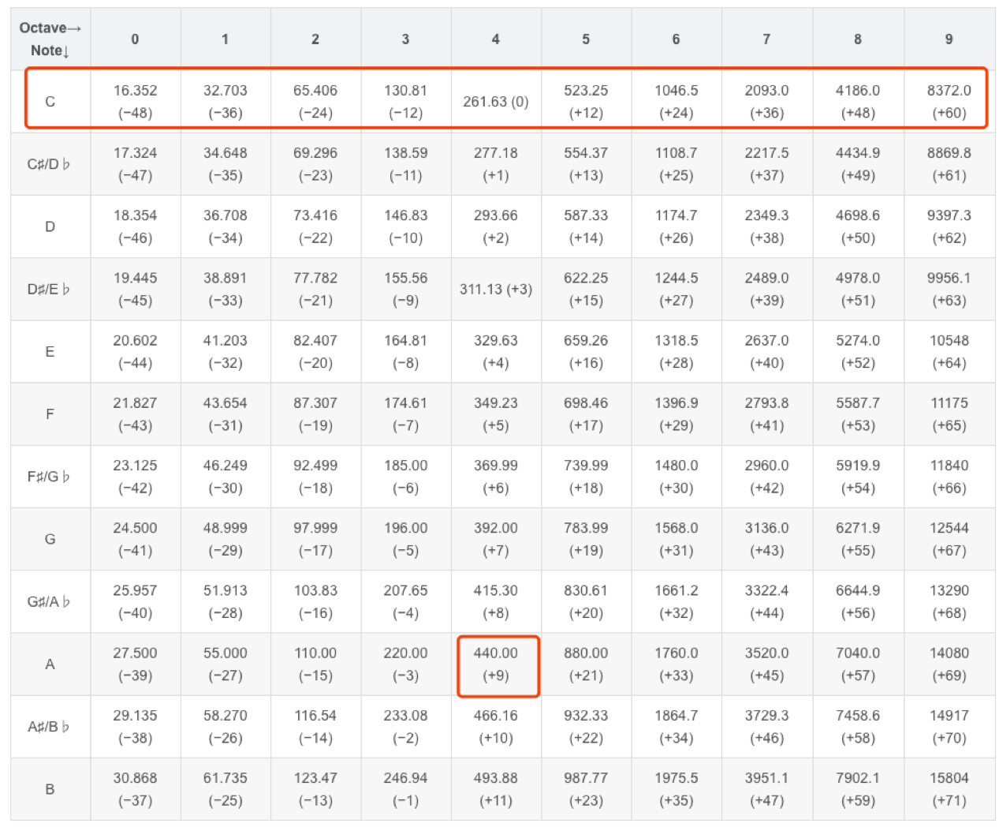

# 乐理初步

音乐是由一系列的声音排列组合而成的。

音乐中的声音，有如下要素：

* 音高（频率）
* 节奏（时长）
* 音色（发音的材质决定）
* 强弱（响度）

音色和强弱不在乐理讨论的范围内，但是如果我们需要自己生成音乐，也需要有所了解。

****

#### 音高和十二平均律

我们知道，人耳听到的声音频率范围大概在`20-20000Hz`，发声范围在`80-1100Hz`。

由于乐器制作和调音也需要标准化，所以现代音乐使用了一些固定频率作为音高，每个音高有其自己的名字。

按照频率从低到高划分了10个等级（0-9），这里的等级也就是我们常说的*八度*。

第`i+1`个八度内的音，频率比第`i`个八度内的音更高。

每个八度内有`12`个音，按从低到高分别是 `C, #C/bD, D, #D/bE, E, F, #F/bG, G, #G/bA, A, #A/bB, B`。

`#`表示升号，`b`表示降号。

我们将上述相邻的两个音称作半音关系。比如`#C`和`C`是半音关系，`E`和`F`是半音关系。

音名`X`+八度编号`i`，构成了一个可以弹奏的音符`X[i]`。

我们用`freq(note)`表示音符`note`的频率。

这些音符的频率有如下关系：

* `freq(X[i+1]) = 2*freq(X[i])`

* `freq(Y) = 2^(1/12) * freq(X)，X和Y是半音关系，且Y比X频率高`

这也就表示，每个音名对应的频率都是上一个半音的`2^(1/12)`倍。

比如`#C0`是`C0`的`2^(1/12)`倍，`D0`是`C0`的`2^(2/12)`倍，`B0`是`C0`的`2^(11/12)`倍。

而`C1`是`C0`的两倍，因此，`C1`是`B0`的`2^(1/12)`倍，也就是说，`B[i]`和`C[i+1]`也属于半音关系。

这就是**十二平均律**，一个八度内的音被平均划分成`12`等分，平均是指倍数上的平均。

当然，实际演奏的时候，也会按需求进行频率的微调，这不在我们讨论的范围内。

#### 节奏

节奏用于表示音乐的快慢，不同速度的曲子，表现的情感和意境是不一样的，因此节奏也是音乐中很重要的因素。

一般通过一分钟的拍子数来决定演奏速度（称作beat per minute, bpm），那么我们就知道一个拍子需要演奏多久了。但我们也需要知道每个音符相对于一个拍子的长度，这样才能知道每个音符要演奏多久。所以我们会给拍子一个单位。

相对时值：常用的有全音符，二分音符，四分音符，八分音符，十六分音符，三十二分音符，三连音（某种时值的三分之一）。

小节：小节是一个概念性术语，用来表示一段连续的拍子，整个曲子一般使用相同的小节划分。一小节的长度用相对时值表示（拍号）：x/y 表示以y分音符为一拍（即单位），一小节有x拍。

比如常用的3/4表示四分音符为一拍，每小节长度为3个四分音符（即3拍）。

绝对时值：即之前提到的bpm。如果bpm为60，一分钟会有60拍，那么对于拍号为4/4的歌曲来说，一分钟会进行60个四分音符，一个四分音符长度为1秒，每小节的长度为4秒，一分钟需演奏15个小节。

休止符：时值表示和其他音符一样，在这段时间内不能发声。

附点：表示对附点所在的音符延长其时值的一半，比如四分音符加附点，其长度为一个四分音符加一个八分音符。二分音符加附点，长度为一个二分音符加一个四分音符。

延音线：将一个小节的音延长到下一个小节，需要使用延音符号

#### 调式

